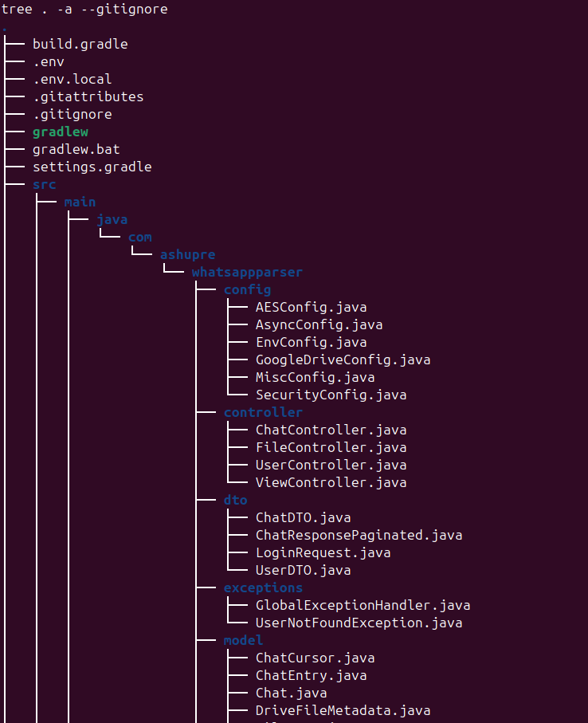
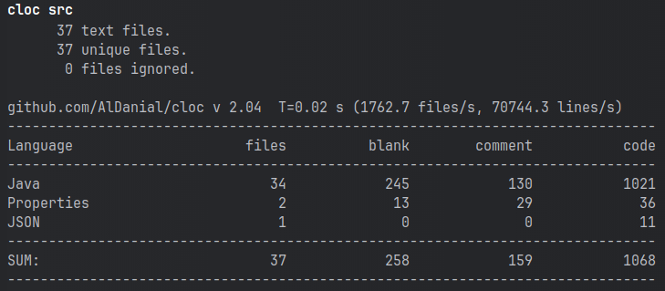

# Project structure

## Top level dirs
### config
Contains configuration files for different aspects of the project such as spring-security, Encryption, Environment variables
etc. They have bean definitions present for the beans used within the project.

### controller
Handles incoming HTTP requests and processes them. Ideally they do minimal HTTP related processing, getting inputs etc..
and delegate the business logic to the service layer. All controllers used here are REST controllers (@RestController, they serve json)
as opposed to the @Controller that can return a view (some html template).

### dto
Contains classes for Data Transfer Objects. These DTOs are used to send data to the client instead of model to ensure
we are not exposing the internal structures to the client (for safety).

### exceptions
Has custom exceptions and a global exception handler.

### model
Contains classes used for mostly DB mappings but can serve other purposes also. DB mapped classes should not be exposed
to client (good practice + safety).

### repository
This layer is directly responsible for communication with the database. In this project we are using spring-data-mongodb. 
It holds interfaces that extend MongoRepository (as we are using mongodb, for sql those would extend JPARepository). In
those we declare functions to for getting data from DB which are implemented for us by spring automatically, making DB
access easy. This is not the only way for getting data as we can also use the MongoTemplate bean to create queries by
ourselves instead.

### security
Contains a util class for AES. It is used for encrypting pagination cursor before sending to the client. Probably
not that necessary to encrypt the cursor but still chose to include it.

### service
Contains main business logic for our application.

### util
Contains utility classes for different functionalities.

# Statistics

# Thanks
[Genuine coder](https://www.youtube.com/@GenuineCoder) - Great for learning spring, also features some other stuff.

