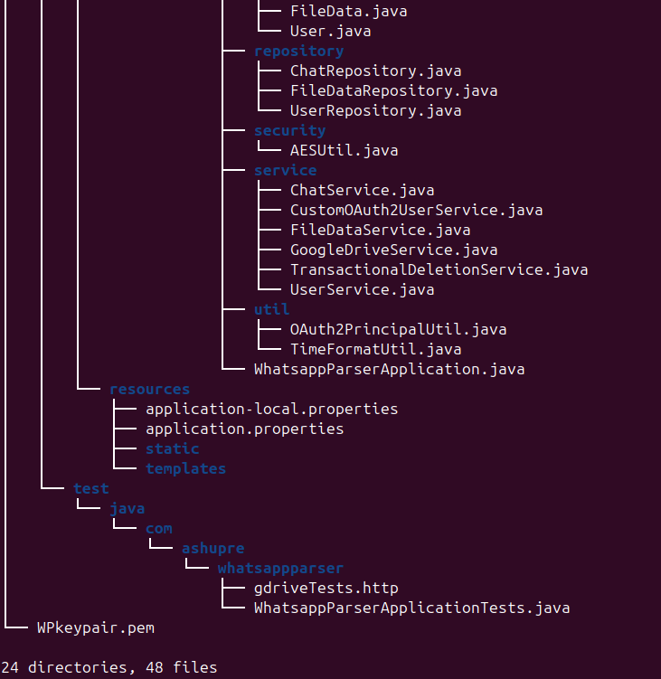

# Project structure
todo : update tree

## Framework - Spring - GOAT
### Spring-boot Spring-data, Spring-security - GOAT

### config
Contains configuration files for different aspects of the project such as spring-security, Encryption, Environment variables
etc. They have bean definitions present for the beans used within the project.

### controller
Handles incoming HTTP requests and processes them. Ideally they do minimal HTTP related processing, getting inputs etc..
and delegate the business logic to the service layer. All controllers used here are REST controllers (@RestController, they serve json)
as opposed to the @Controller that can return a view (some html template).

### dto
Contains classes for Data Transfer Objects. These DTOs are used to send data to the client instead of model to ensure
we are not exposing the internal structures to the client (for safety).

### exceptions
Has custom exceptions and a global exception handler to send end appropriate responses to client on some exceptions.

### model
Contains classes used for mostly DB mappings but can serve other purposes also. DB mapped classes should not be exposed
to client (good practice + safety).

### repository
This layer is directly responsible for communication with the database. In this project we are using spring-data-mongodb. 
It holds interfaces that extend MongoRepository (as we are using mongodb, for sql those would extend JPARepository). In
those we declare functions to for getting data from DB which are implemented for us by spring automatically, making DB
access easy. This is not the only way for getting data as we can also use the MongoTemplate bean to create queries by
ourselves instead.

### security
Contains a util class for AES. It is used for encrypting pagination cursor before sending to the client. Probably
not that necessary to encrypt the cursor but still chose to include it.

### service
Contains main business logic for our application.

### util
Contains utility classes for different functionalities.

## Glorified HashMap.. Uh.. I mean DATABASE
Using Mongodb Atlas for the prod database saving us time setting up local mongodb and has pre-configured fault
tolerance related stuff (Setting up locally is also simple anyways [have local setup in my pc]).

### Local testing
Have a separate local DB for local testing, as we are using transactions for mongodb, it will not work with "out of the box"
local mongodb configuration - Hence added a replica set to local mongodb

#### procedure for adding replica-set locally
Adding replica-set locally allowed me to use mongodb transactions. It also significantly sped-up file upload and deletion 
in local-testing helping me test faster (apart from in code parallelization I did).

##### Better do with a clean new mongodb setup to save hassle (or) delete curr stuff and do setup from start. If local mongodb data is needed, backup data (lookup on internet) and do these steps.
Stop mongod (mongo daemon)
    
    sudo systemctl stop mongod

Edit config file - /etc/mongod.conf -> add the following and save it

    replication:
        replSetName: "rs0"

Start mongod and verify it is active 

    sudo systemctl start mongod
    sudo systemctl status mongod

Goto mongosh (mongoshell) and initialize replica-set for the DB

    mongosh # below commands are to be typed in the mongo shell

        use <DB-name> # mine was WhatsappParserLocal so - use WhatsappParserLocal
        rs.initiate()
        rs.status() # verify that it initiated properly

# Statistics

# Thanks
- [Genuine coder](https://www.youtube.com/@GenuineCoder) - Great for learning spring, also features some other stuff.
- [cloc util](https://github.com/AlDanial/cloc) - Used in this file to Count Lines Of Code
- [Literally SpringBOOT](https://tenor.com/view/goofy-shoes-gif-26687557)